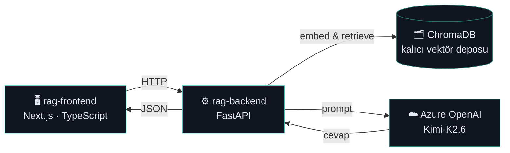

<div align="center">


# 🏛️ Mevzuat Asistanı

### *Bankacılık mevzuatını okuyun demeyin, sorun.*

Yüklediğiniz kanun ve yönetmelik PDF'lerini vektörleştirip, sorulara **yalnızca o kaynaklara dayanarak**, madde ve sayfa referansı vererek cevap üreten kurumsal RAG asistanı.

[](https://nextjs.org/)
[](https://fastapi.tiangolo.com/)
[](https://azure.microsoft.com/en-us/products/ai-services/openai-service)
[](https://www.langchain.com/)
[](https://www.trychroma.com/)
[](https://www.typescriptlang.org/)

<br/>


</div>

---

## 🎯 Ne İşe Yarıyor?

Bankacılık, ödeme sistemleri ve operasyon ekipleri her gün onlarca sayfalık mevzuat metninde arama yapmak zorunda kalır. **Mevzuat Asistanı**, bu süreci bir sohbete indirger:

```
📄 PDF yükle  →  🧠 vektörize et  →  ❓ soru sor  →  ✅ madde referanslı cevap al
```

Cevap üretilirken kullanılan her kaynak, **belge adı + sayfa numarası + orijinal metin parçası** ile birlikte gösterilir — "asistan uydurmuyor, gösteriyor" prensibiyle çalışır.

---

## 🏗️ Mimari

<div align="center">



</div>

Yeni bir PDF yüklendiğinde **yalnızca o dosya** parçalanıp vektörleştirilir — tüm veritabanı sıfırdan kurulmaz, kalıcı Chroma deposuna eklenir.

---

## ✨ Özellikler

| | |
|---|---|
| 🧩 **Kaynak Gösterimi** | Her cevabın altında hangi belge, hangi sayfa, hangi metin parçası kullanıldığı açılır listede görünür |
| 📤 **Sürükle-Bırak Yükleme** | PDF'leri panelde sürükleyip bırakmanız yeterli, kalan işi vektörizasyon hattı halleder |
| ⚡ **Artımlı (Incremental) İşleme** | Yeni PDF eklendiğinde tüm kütüphane değil, yalnızca yeni belge işlenir |
| 💬 **Bağlamlı Sohbet** | Son mesajlar dikkate alınarak takip sorularına da tutarlı cevap üretilir |
| 🌓 **Açık / Koyu Tema** | Göz yorgunluğuna göre arayüz teması anında değiştirilebilir |
| 🚫 **Uydurmama Garantisi** | Cevap, sağlanan mevzuat metninde yoksa asistan bunu açıkça belirtir |

---

## 🛠️ Teknoloji Yığını

<table>
<tr>
<td valign="top" width="50%">

**Frontend**
| Katman | Teknoloji |
|---|---|
| Framework | `Next.js 15 (App Router)` |
| Dil | `TypeScript` |
| Stil | `Custom CSS` (Fraunces + Source Sans) |
| Durum | `React Hooks` |

</td>
<td valign="top" width="50%">

**Backend**
| Katman | Teknoloji |
|---|---|
| API | `FastAPI` + `Uvicorn` |
| RAG Orkestrasyon | `LangChain` |
| Embedding | `intfloat/multilingual-e5-base` |
| Vektör DB | `ChromaDB` (kalıcı) |
| LLM | `Azure OpenAI (Kimi-K2.6)` |

</td>
</tr>
</table>

---

## 📦 Hızlı Kurulum

Projeyi yerelinizde ayağa kaldırmak birkaç dakikanızı alır:

**1. Repoyu klonlayın**

```bash
git clone https://github.com/Tahabozkurt/Rag.git
cd Rag
```

**2. Backend'i çalıştırın**

```bash
cd rag-backend
python -m venv venv && source venv/bin/activate
pip install -r requirements.txt
```

`.env` dosyanızı oluşturun:

```env
AZURE_OPENAI_API_KEY=your_key
AZURE_OPENAI_ENDPOINT=your_endpoint
AZURE_OPENAI_API_VERSION=2024-02-01
AZURE_DEPLOYMENT_NAME=Kimi-K2.6
```

```bash
uvicorn api:app --reload --port 8000
```

**3. Frontend'i çalıştırın**

```bash
cd rag-frontend
npm install
```

`.env.local` dosyanızı oluşturun:

```env
NEXT_PUBLIC_API_URL=http://localhost:8000
```

```bash
npm run dev
```

**4. Açın** → [http://localhost:3000](http://localhost:3000) 🎉

> Detaylı API dokümantasyonu için backend çalışırken `http://localhost:8000/docs` adresini ziyaret edin.

---

## 📁 Klasör Yapısı

```
Rag/
├── rag-backend/          ⚙️  FastAPI + RAG mantığı
│   ├── api.py               REST API katmanı
│   ├── database.py          Chroma vektör işlemleri
│   ├── llm_service.py       Azure OpenAI entegrasyonu
│   ├── document_manager.py  PDF yükleme & kayıt
│   └── app.py                (opsiyonel) Streamlit arayüzü
│
└── rag-frontend/          🖥️  Next.js sohbet arayüzü
    ├── app/                   Sayfalar & API istemcisi
    ├── components/            Sohbet, yükleme, kaynak bileşenleri
    └── lib/                    Tipler & yerel depolama
```

---

## 🔒 Güvenlik

`rag-backend/.env` ve `rag-frontend/.env.local` dosyaları `.gitignore` ile korunur, repoya asla girmez. API anahtarlarınızı hiçbir zaman doğrudan koda yazmayın.

---

## 👨‍💻 Geliştirici

<div align="center">

**Taha Bozkurt**

[](https://github.com/Tahabozkurt)
[](https://www.linkedin.com/in/taha-bozkurt/)

<sub>Mevzuat Asistanı, bir **Taha Bozkurt** projesidir · © 2026</sub>

</div>
